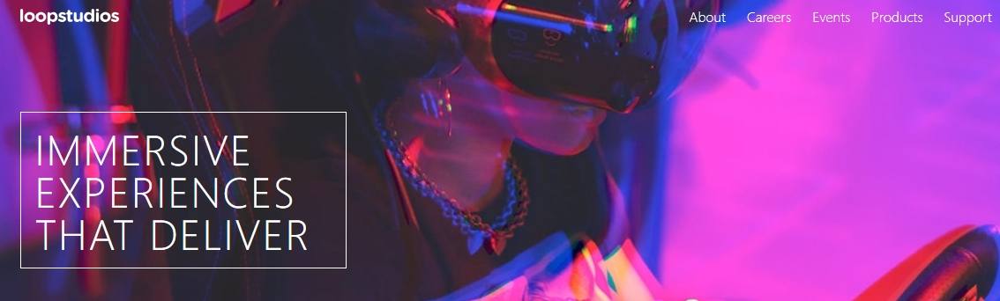

# Frontend Mentor - Loopstudios landing page solution

This is a solution to the [Loopstudios landing page challenge on Frontend Mentor](https://www.frontendmentor.io/challenges/loopstudios-landing-page-N88J5Onjw). Frontend Mentor challenges help you improve your coding skills by building realistic projects. 

## Table of contents

- [Overview](#overview)
  - [The challenge](#the-challenge)
  - [Screenshot](#screenshot)
  - [Links](#links)
- [My process](#my-process)
  - [Built with](#built-with)
  - [What I learned](#what-i-learned)
- [Author](#author)


## Overview

### The challenge

Users should be able to:

- View the optimal layout for the site depending on their device's screen size
- See hover states for all interactive elements on the page

### Screenshot



### Links

- Solution URL: [Add solution URL here](https://github.com/dimitrisdr/loopstudios-landing-page.git)
- Live Site URL: [Add live site URL here](https://dimitrisdr.github.io/loopstudios-landing-page/)

## My process

### Built with

- Semantic HTML5 markup
- CSS custom properties
- Flexbox
- CSS Grid
- Mobile-first workflow

### What I learned


```html
    <figure class="gallery-item fw-300">
      <picture class="gallery-item__img-container">
        <source media="(min-width:601px)" srcset="images\desktop\image-night-arcade.jpg">
        
      </picture>
      <figcaption class="img-description">Night <br> arcade</figcaption>
    </figure>
```
```css
  .link-hover {
      position: relative;
  }

  .link-hover::after {
      content: '';
      position: absolute;
      left: 50%;
      transform: translateX(-50%) scale(0, 1);
      top:calc(100% + 0.3rem);
      width: 50%;
      height: 2px;
      background-color: var(--White);
      transition: transform 0.2s ease-in;
  }

  .link-hover:hover::after {
      transform: translateX(-50%) scale(1, 1);
  }
```
## Author

- Frontend Mentor - [@dimitrisdr](https://www.frontendmentor.io/profile/dimitrisdr)